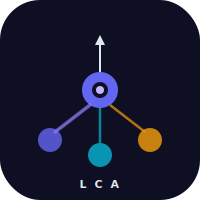
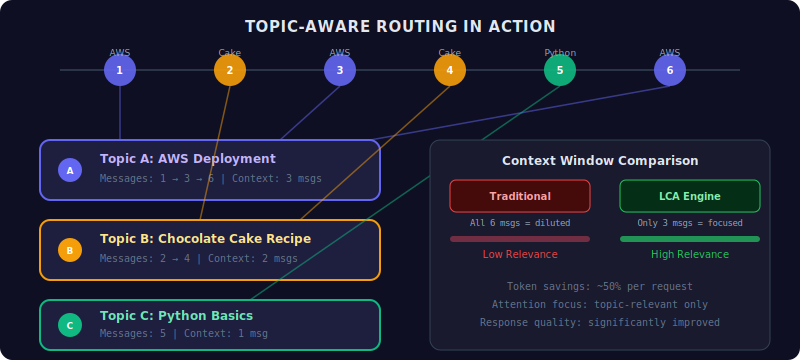
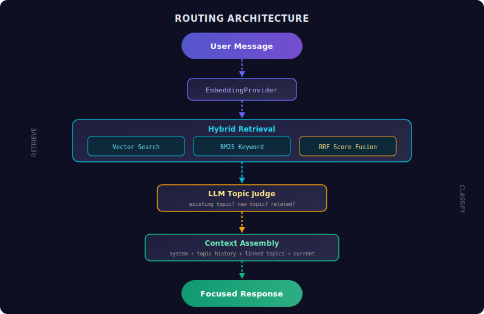

<p align="center">
  
</p>

<h1 align="center">Lang Context Attention</h1>

<p align="center">
  <strong>Topic-aware context routing for LLM conversations</strong><br/>
  <strong>面向 LLM 对话的主题感知上下文路由引擎</strong>
</p>

<p align="center">
  <a href="https://www.npmjs.com/package/@lang-context/core"></a>
  <a href="https://www.npmjs.com/package/@lang-context/store-sqlite"></a>
  <a href="https://www.npmjs.com/package/@lang-context/provider-ai-sdk"></a>
  
  
</p>

<p align="center">
  <a href="#quick-start">Quick Start</a> |
  <a href="#architecture">Architecture</a> |
  <a href="#engine-api">API</a> |
  <a href="#demo-app">Demo</a> |
  <a href="#中文文档">中文文档</a>
</p>

---

## The Problem

In multi-turn LLM conversations, users naturally jump between topics. Traditional approaches either stuff the **entire** chat history into the context window (wasting tokens, diluting attention) or naively truncate older messages (losing critical context).

**The result**: degraded response quality, wasted tokens, and lost context.

## The Solution

LCA automatically clusters messages by topic and routes each request to only the relevant context — like giving your LLM a focused conversation instead of a noisy room.

<p align="center">
  
</p>

### How It Works

<p align="center">
  
</p>

1. **Embed** — User message is vectorized
2. **Retrieve** — Hybrid search (vector similarity + BM25 keywords) finds candidate topics
3. **Fuse** — Reciprocal Rank Fusion (RRF) combines scores from both retrieval methods
4. **Judge** — LLM classifies: existing topic, new topic, or related topics
5. **Assemble** — Only relevant topic history is assembled (with token budget)
6. **Respond** — LLM generates a focused, context-aware response

## Quick Start

```bash
# Install
pnpm add @lang-context/core @lang-context/store-sqlite @lang-context/provider-ai-sdk

# Or run the demo
git clone https://github.com/me-tool/lang-context-attention.git
cd lang-context-attention
pnpm install && pnpm build
cd apps/demo && pnpm dev
```

## Architecture

```
packages/
  core/                # Engine SDK — routing, context assembly, interfaces
  store-sqlite/        # Default storage — SQLite + sqlite-vec + FTS5
  provider-ai-sdk/     # Default LLM — Vercel AI SDK + AI Gateway
apps/
  demo/                # Next.js demo with full UI
```

### Pluggable Everything

Every component is replaceable via clean interfaces:

```typescript
import { createEngine } from '@lang-context/core'
import { SqliteStore, SqliteVectorSearch, SqliteKeywordSearch, createDatabase } from '@lang-context/store-sqlite'
import { AiSdkChatProvider, AiSdkJudgeProvider, AiSdkEmbeddingProvider } from '@lang-context/provider-ai-sdk'
import { openai } from '@ai-sdk/openai'

const db = createDatabase('./conversations.db')

const engine = createEngine({
  store: new SqliteStore(db),
  vectorSearch: new SqliteVectorSearch(db, 1536),
  keywordSearch: new SqliteKeywordSearch(db),
  chat: new AiSdkChatProvider(openai('gpt-4o-mini')),
  judge: new AiSdkJudgeProvider({ model: openai('gpt-4o-mini') }),
  embedding: new AiSdkEmbeddingProvider({
    model: openai.embedding('text-embedding-3-small'),
    dimensions: 1536,
  }),
})
```

## Engine API

```typescript
// Create a session
const session = await engine.createSession('You are helpful.', 'My Session')

// Process message — automatically routes to the right topic
const { stream, routingDecision, rootQuestionId } =
  await engine.processMessage(session.id, 'How do I deploy to AWS?')

// Stream the response
for await (const chunk of stream) {
  process.stdout.write(chunk)
}

// Inspect routing
console.log(routingDecision.llmJudgment.reasoning)
// → "Matched topic 'AWS Deployment' (score: 0.0328, 3 stem overlaps)"

// Query data
const topics = await engine.getRootQuestions(session.id)
const messages = await engine.getMessages(rootQuestionId)
const timeline = await engine.getTimeline(session.id)

// Manual operations
await engine.reassignMessage(messageId, correctTopicId)
await engine.linkQuestions(topicA, topicB)
```

## Configuration

```typescript
createEngine({
  // ... providers ...
  topK: 5,                      // Retrieval candidates per search
  minFusedScoreForJudge: 0.01,  // RRF threshold for judge consultation
  rrfK: 60,                     // RRF fusion constant
  maxContextTokens: 4000,       // Token budget for assembled context
  summaryUpdateInterval: 5,     // Re-summarize topic every N messages
  summaryContextSize: 10,       // Messages included in summary prompt

  // Callbacks
  onLinkSuggestion: (s) => console.log(`Link suggested: ${s.sourceSummary} ↔ ${s.targetSummary}`),
  onRoutingComplete: (d) => console.log(`Routed in ${d.timing.totalMs}ms`),
})
```

## Demo App

The demo includes a full three-panel UI:

| Panel | Shortcut | Function |
|-------|----------|----------|
| Topic Tree | `Cmd+B` | Browse topics, filter messages |
| Chat Area | — | Streaming chat with topic color coding |
| Debug Panel | `Cmd+D` | Inspect routing decisions, scores, timing |

**Additional features:**
- Right-click message reassignment (fix routing errors)
- Link suggestion banners (when topics may be related)
- Works without API key (local embedding + keyword matching)

```bash
# No API key needed
cd apps/demo && pnpm dev

# Full experience with OpenAI
echo "OPENAI_API_KEY=sk-xxx" > apps/demo/.env.local
cd apps/demo && pnpm dev
```

## Testing

```bash
pnpm test   # 43 tests across all packages

# By package
pnpm --filter @lang-context/core test          # 18 tests (router, context, engine integration)
pnpm --filter @lang-context/store-sqlite test   # 22 tests (CRUD, vector search, keyword search)
pnpm --filter @lang-context/provider-ai-sdk test # 3 tests (judge prompt, structured output)
```

Integration tests verify multi-round routing:
- Cold start → Follow-up routing → New topic detection
- 5-round interleaved conversation across 2 topics
- Message reassignment and topic linking

## Roadmap

- [x] **v1a**: Core engine + SQLite storage + Vercel AI SDK + Demo app
- [ ] **v1b**: Cmd+K quick panel, drag-to-reassign, session management
- [ ] **v2**: Auto cross-topic linking, PostgreSQL adapter, mobile layout

## License

MIT

---

<a name="中文文档"></a>

## 中文文档

### 问题

在多轮 LLM 对话中，用户经常在不同话题之间跳跃。传统方案要么将**全部**聊天记录塞入上下文窗口（浪费 token、稀释注意力），要么简单截断旧消息（丢失关键上下文）。

### 解决方案

LCA 自动将消息按主题聚类，每次请求只组装相关主题的上下文 — 让 LLM 专注于当前话题，而非在噪音中寻找答案。

### 工作原理

1. **向量化** — 用户消息生成 embedding
2. **混合检索** — 向量相似度 + BM25 关键词匹配，并行搜索候选主题
3. **分数融合** — RRF（倒数排名融合）合并两路检索分数
4. **LLM 判定** — 判断：归属已有主题 / 创建新主题 / 建议关联
5. **上下文组装** — 仅拼接相关主题的对话历史（含 token 预算控制）
6. **流式响应** — LLM 生成聚焦、上下文准确的回复

### 快速开始

```bash
# 安装依赖
pnpm add @lang-context/core @lang-context/store-sqlite @lang-context/provider-ai-sdk

# 或直接运行 Demo
git clone https://github.com/me-tool/lang-context-attention.git
cd lang-context-attention
pnpm install && pnpm build
cd apps/demo && pnpm dev
# 打开 http://localhost:3000
```

### 核心特性

| 特性 | 说明 |
|------|------|
| 主题自动分流 | 基于混合检索 + LLM 判定，自动将消息归类到正确主题 |
| 上下文精准组装 | 仅包含相关主题的对话历史，节省约 50% token |
| 可插拔架构 | 存储、搜索、LLM 均可替换，提供默认 SQLite + Vercel AI SDK 实现 |
| 可观测性 | 完整记录路由决策（候选分数、判定理由、耗时、上下文快照） |
| 容错设计 | 支持消息重新分配（修正路由错误）、主题手动关联 |
| 无 API Key 可用 | 内置本地 embedding + 关键词匹配，开箱即用 |

### 项目结构

```
packages/
  core/              # 引擎 SDK — 路由、上下文组装、Provider 接口定义
  store-sqlite/      # 默认存储 — SQLite + sqlite-vec 向量搜索 + FTS5 全文检索
  provider-ai-sdk/   # 默认 LLM — Vercel AI SDK (chat / judge / embedding)
apps/
  demo/              # Next.js 演示应用（三栏布局 + 流式响应 + 调试面板）
```

### 配置说明

| 参数 | 默认值 | 说明 |
|------|--------|------|
| `topK` | 5 | 每次检索的候选主题数 |
| `rrfK` | 60 | RRF 融合常数（来自原论文） |
| `minFusedScoreForJudge` | 0.01 | 低于此分数直接创建新主题 |
| `maxContextTokens` | 4000 | 上下文组装的 token 预算 |
| `summaryUpdateInterval` | 5 | 每 N 条消息更新主题摘要 |
| `summaryContextSize` | 10 | 摘要生成时包含的最近消息数 |
